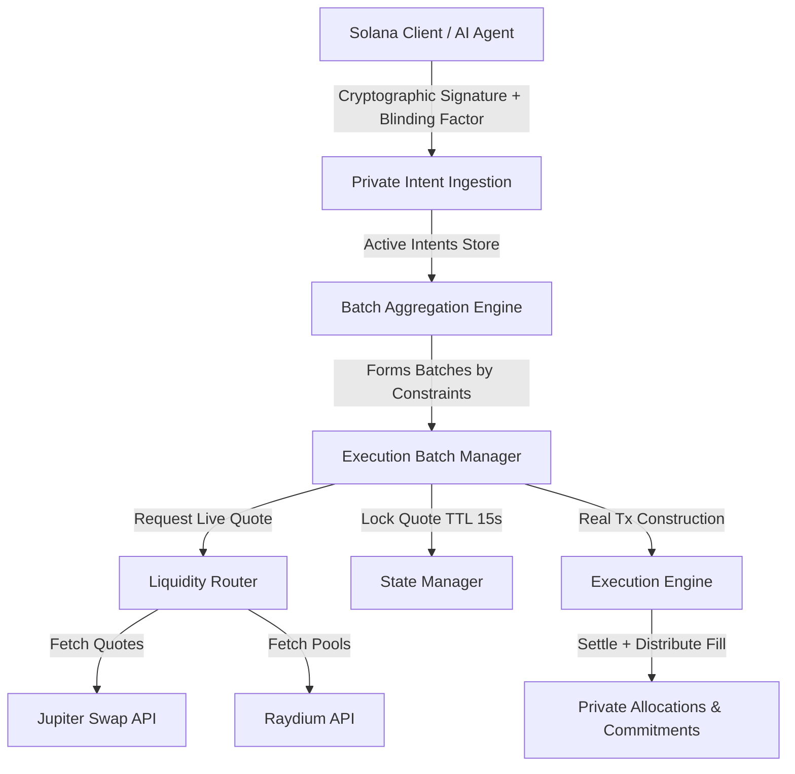

# Vella Finance

Vella Finance is a privacy-preserving **Private Intent Aggregation and Routing Layer for Solana**. It ingests individual trade intents, aggregates them into compatible execution batches, routes them through the best live liquidity pools (such as Jupiter and Raydium), construct real swap transactions, and anchors execution proofs on-chain while maintaining user transaction privacy.

---

## Technical Architecture



### Core Components

1. **Cryptographic Ingestion & Verification**:
   - Every trade intent requires a cryptographic Ed25519 signature from the owner wallet, validated against the Solana public key.
   - User-delegated AI Agent actions are restricted via cryptographically signed `AgentPermissions` validating maximum daily volume, max trade size, allowed tokens, and slippage bounds.
   
2. **Batch Aggregation Engine (`src/engine/batchAggregationEngine.ts`)**:
   - Combines compatible intents by asset pair, trade direction (side), and compatibility of routing constraints.
   - Enforces execution windows ensuring intents fit within the maximum allowed batch timeout.
   
3. **Liquidity Router (`src/engine/liquidityRouter.ts`)**:
   - Queries live Jupiter and Raydium routes.
   - Implements `strictProviders` routing behavior (configurable in `.env` via `STRICT_PROVIDERS`), failing gracefully or strictly depending on system risk configuration.
   - Validates that routes satisfy the minimum output requirements of every individual intent in the batch.
   
4. **Execution & Settlement Engine (`src/engine/executionEngine.ts`)**:
   - Constructs real base64-serialized Jupiter swap transactions for execution.
   - Allocates fills proportionally across intents in the batch.
   - Generates deterministic execution result hashes and commitments.

5. **Commitment Privacy Model (`src/privacy/commitments.ts`)**:
   - Employs private `blindingFactor` (secret salts) to generate unlinkable public commitment roots, preventing transaction tracking back to individual wallets.

---

## API Documentation

### Private Intent Flow

#### 1. Ingest Private Intent
* **Endpoint**: `POST /api/intents`
* **Payload**:
  ```json
  {
    "ownerWallet": "VellaExecut11111111111111111111111111111111",
    "inputMint": "EPjFWdd5AufqSSqeM2qN1xzybapC8G4wEGGkZwyTDt1v",
    "outputMint": "So11111111111111111111111111111111111111112",
    "side": "swap",
    "amountIn": "1000000",
    "maxSlippageBps": 100,
    "blindingFactor": "2e67fa2382c9e782e34279ab87201de3",
    "signature": "base58_encoded_ed25519_signature"
  }
  ```
* **Returns**: Ingested intent metadata and private commitment hash.

#### 2. Form Execution Batches
* **Endpoint**: `POST /api/batches/aggregate`
* **Description**: Groups all active pending intents into compatible execution batches.

#### 3. Quote Batch Route (TTL Lock)
* **Endpoint**: `POST /api/execution-batches/:id/quote`
* **Description**: Fetches live liquidity routes, filters by intent requirements, selects the best route, and locks the quote for 15 seconds.

#### 4. Execute Batch
* **Endpoint**: `POST /api/execution-batches/:id/execute`
* **Description**: Validates quote TTL, constructs the real Solana swap transaction, settles the batch, and records proportional allocations.

---

## Configuration

Set the following environment variables in a `.env` file at the root:

```env
PORT=4000
JUPITER_API_KEY=your_jupiter_api_key_here
STRICT_PROVIDERS=false
INTEGRATION_REQUEST_TIMEOUT_MS=10000
```

---

## Setup & Running

### 1. Install Dependencies
```bash
npm install
```

### 2. Build the Project
```bash
npm run build
```

### 3. Run the Server
```bash
npm run dev
```

The application serves a **Dark-Mode Dashboard** at `http://localhost:4000` containing client-side cryptographic keypair generators, signature calculators, batch orchestrators, and a live API log console.
